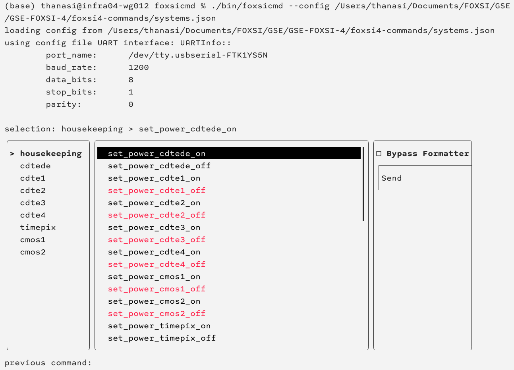

# foxsicmd

A very small command line application to command the Formatter over 

## Building
You'll need an installation of [`boost::asio`](https://www.boost.org/users/download/) to use this. If you use homebrew, you can do:

```bash
$ brew install boost
```

The JSON header-only library [`nlohmann::json`](https://json.nlohmann.me/) is bundled in this repository already. So you shouldn't need to worry about it.

If you don't have `CMake` yet, you can also get it through homebrew:
```bash
$ brew install cmake
```

The other dependency, [`FTXUI`](https://github.com/ArthurSonzogni/FTXUI), will automatically be retrieved when you build.

To build this software, do this:
```bash
$ cd ptui
$ mkdir build
$ cd build
$ cmake ..
$ cmake --build .
```

## Operation

You can run this tool like this:
```bash
./bin/foxsicmd [options]
```

The options are:
- `--help` or `-h`: display a help message listing these options.
- `--config` or `-c` `<path to file>`: (required) pass in a path to a configuration file. The file [`foxsi4-commands/systems.json`](https://github.com/foxsi/foxsi4-commands/blob/main/systems.json) is expected here. You can write your own if you follow the same structure as the link (or just clone and edit that one).
  - By default, `foxsicmd` will open the serial device from the JSON file for the `gse` system: `gse.logger_interface.uplink_device`. It will configure this device using settings (baud rate, parity bits, data bits, stop bits) under the `uplink` system.
  - Note that the `systems.json` file itself refers to other command definition files under `foxsi4-commands`. So if you are cloning, download the whole repository instead of only the `systems.json` file. Ignore this if you have installed `foxsi4-commands` as a git submodule.
- `--port` or `-p` `<path to serial device>`: substitute a different serial device from the one in the config file you passed. Note: the device settings (baud rate, parity bits, data bits, stop bits) will still be defined in the config file.
- `--timepix` or `-t`: use the serial device definitions under `timepix.uart_interface` in the config file instead of the defaults. Note: the `timepix` serial device path can still be overwritten by passing the `--port` argument.

When you run, you will see a window that looks like this:


The UI mirrors the [FOXSI GSE](https://github.com/foxsi/gse-foxsi-4) command uplink window. The leftmost interactive column allows selection of a system to command. The center interactive column allows selection of a command to send to that system. The rightmost column has a button to actually **Send** the command over the serial link, and a checkbox option to "Bypass Formatter." 

Without checking the Bypass Formatter box, the serial output from `foxsicmd` is intended to be received and processed by the Formatter. All commands are sent in the typical two-byte (system code, then command code) format.

The Bypass Formatter option is currently only available for Timepix. If checked, the serial output from `foxsicmd` is *as if the Formatter had sent it to Timepix*. This allwos `foxsicmd` to be used to test the Timepix system in place of the Formatter. This checkbox option would be typically used in conjunction with the `--timepix` command line option.

## Examples
To run with the default FOXSI commanding settings (using the FOXSI command uplink harnessing, Formatter software, etc):
```bash
./bin/foxsicmd --config /path/to/foxsi4-commands/systems.json
```

In this configuration, you can command the Formatter just like using the FOXSI GSE command uplink window. It's just in the terminal instead.

To run with the default UART configuration for Timepix instead, do:
```bash
./bin/foxsicmd --config /path/to/foxsi4-commands/systems.json --timepix
```

To run with the default UART configuration for Timepix but using your own serial device, do:
```bash
./bin/foxsicmd --config /path/to/foxsi4-commands/systems.json --port /dev/ttyMyDevice --timepix
```
