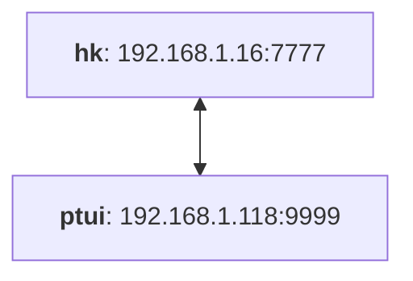
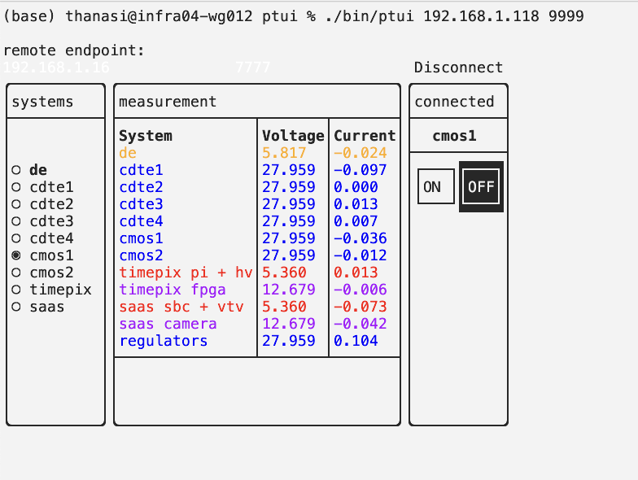

# ptui

A tiny power monitor for the FOXSI housekeeping board. You can use it to turn systems on/off, and watch current/voltage values. Samples power board at 1 Hz and logs to a CSV file.

## Physical configuration



## Building
You'll need an installation of [`boost::asio`](https://www.boost.org/users/download/) to use this. If you use homebrew, you can do:

```bash
$ brew install boost
```

If you don't have `CMake` yet, you can also get it through homebrew:
```bash
$ brew install cmake
```

The other dependency, [`FTXUI`](https://github.com/ArthurSonzogni/FTXUI), will automatically be retrieved when you build.

To build this software, do this:
```bash
$ cd ptui
$ mkdir build
$ cd build
$ cmake ..
$ cmake --build .
```

## Testing
You can test your build by running the test application, 
```bash
$ ./bin/hkp_test
```

You should see a few lines print out before it exits after 5 seconds. After the program stops, check the folder `log/`. It should contain a raw data file (`raw_*`) and a CSV file (`parse_*`) with suffixes indicating the year-month-day_hour_minute_second_millisecond that you ran the test.

## Operation
Before running, you will need a Housekeeping board with power, and an Ethernet connection to the machine running this software. Your network configuration should permit you to bind a local socket to an address in the 192.168.1.XXX subnetwork.

Run it like this:
```bash
$ ./bin/ptui ipaddress port
```
providing your local IP address and port for your end of the connection. For example, the GSE computer would be run with local IP address 192.168.1.118 and port 9999. Once the UI launches, you can input the remote IP and port of the Housekeeping board. These are `192.168.1.16` and `7777`:



Click the `Connect...` button to connect to the housekeeping board. After connecting, you can select a system on the left and turn it on or off on the right. Data is sampled at 1 Hz from the board, and displays in the center column. Data is also written to a time-tagged CSV file in `log/`.

If you just want to test it out, you can launch the debug server in another terminal like this:

```bash
$ ./bin/debug-server server_ip server_port
```

and connect to it using `ptui` to see some dummy data. After launching `ptui`, provide the `server_ip` and `server_port` you had input when launching the debug server.