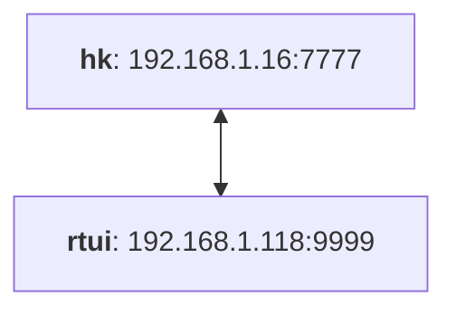
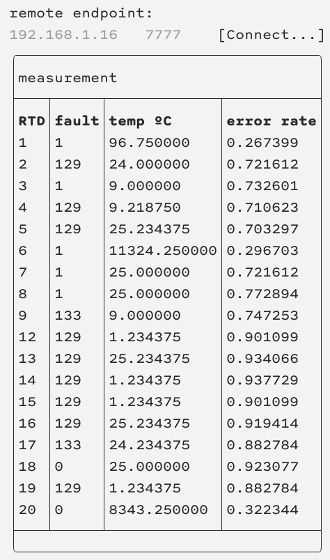

# rtui

A tiny RTD monitor for the FOXSI housekeeping board. Currently it just displays live readout from the RTDs. The channel number displayed corresponds to the PCB header number and the labeled harness numbering (see FOXSI-4 focal plane assembly procedure, Appendix A).

## Physical configuration



## Building
You'll need an installation of [`boost::asio`](https://www.boost.org/users/download/) to use this. If you use homebrew, you can do:

```bash
$ brew install boost
```

If you don't have `CMake` yet, you can also get it through homebrew:
```bash
$ brew install cmake
```

The other dependency, [`FTXUI`](https://github.com/ArthurSonzogni/FTXUI), will automatically be retrieved when you build.

To build this software, do this:
```bash
$ cd rtui
$ mkdir build
$ cd build
$ cmake ..
$ cmake --build .
```

## Testing
There is currently no standalone test for this package.

## Operation
Before running, you will need a Housekeeping board with power, and an Ethernet connection to the machine running this software. Your network configuration should permit you to bind a local socket to an address in the 192.168.1.XXX subnetwork.

Run it like this:
```bash
$ ./bin/rtui ipaddress port
```
providing **your local IP address and port** for your computer's side of the connection. For example, the GSE computer would be run with local IP address 192.168.1.118 and port 9999. Once the UI launches, you can input the remote IP and port of the Housekeeping board. These are `192.168.1.16` and `7777`:



Click the `Connect...` button to connect to the housekeeping board. After connecting, the software will take a couple seconds to initalize the board, then will display a new reading every ~1.5 s. The display appears sluggish but this is normal.

You will see an RTD channel number column, a fault indicator column, a converted temperature, and a fault rate column (fault rate is called "error rate" in the above screenshot, but that has changed). When `fault` is not equal to `1`, the readout chip has flagged the measurement as likely faulty. The fault rate is the accumulated ratio of faulty measurements to total measurements.

The temperature readout and parsing is based entirely on information in the [LTC2983](https://www.analog.com/media/en/technical-documentation/data-sheets/2983fc.pdf) datasheet.

### Exiting
You can `rtui` with `ctrl-C` like other terminal programs. But! Because of the way the UI is "drawn" (by writing characters on your terminal really fast), in some terminals you will continue to see printout on your terminal even after exiting.

On my machine, using the native macOS Terminal application, or the [kitty](https://sw.kovidgoyal.net/kitty/) terminal, or [wezterm](https://github.com/wez/wezterm), I can exit `rtui` cleanly by first hitting the `Disconnect` button before `ctrl-C`. This avoids a huge dump of characters on the command line.

If I don't `Disconnect` first, I can get rid of the character dumping issue by doing the following after `ctrl-C`:
1. Don't move the cursor. Moving the cursor makes the characters appear.
2. Hit `ctrl-C` again to get a blank line for command prompt.
3. If you still haven't moved your cursor, type `reset` and hit enter to reload your terminal. Now you should be able to use the prompt normally again.